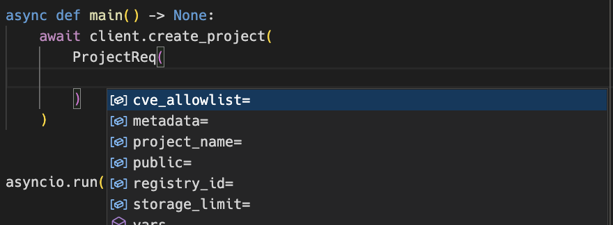
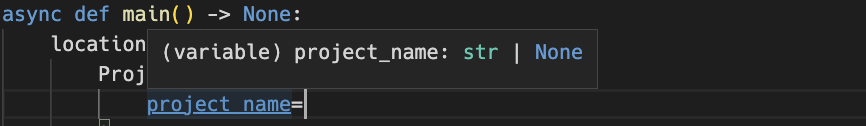

# Models

Most client methods either return a Pydantic model or take one as an argument. You don't need to know anything about Pydantic to use the models, but it's a good idea to familiarize yourself with the basics through the [Pydantic v1.x docs](https://docs.pydantic.dev/1.10/) to get the most out of the library.

All models are located in the [`harborapi.models`][harborapi.models.models] module.

```py
from harborapi.models import *
```

## Pydantic models

Through the Pydantic models, we get a lot of nice features for free, such as:

- Validation of data
- Automatic conversion of data types
- Utility functions for (de)serializing data

We'll look at some of these features later, but first, let's look at how the models are used at a basic level.

## Using models returned by the API

When calling a GET endpoint with a `get_*` method, we usually get a model instance back. For example, when calling the [`get_project`](../methods/get.md/#get_project) method, we get a [`Project`](../models/project.md/#project) instance back:

```py
import asyncio
from harborapi import HarborAsyncClient

client = HarborAsyncClient(...)

async def main() -> None:
    project = await client.get_project("library")


asyncio.run(main())
```

In the IDE, we can see the various attributes the model instance has:


Also shown in the screenshot are the utility methods `json` and `dict`, which allows you to convert models to JSON and Python dictionaries, respectively.


## Using models to create and update resources

Similar to how the `get_*` methods _return_ models, the `create_*` and `update_*` methods _take_ models as arguments. For example, the [`create_project`](../methods/create-update.md/#create_project) method takes a [`ProjectReq`](../models/project.md/#projectreq) model as an argument:

```py
import asyncio
from harborapi import HarborAsyncClient
from harborapi.models import ProjectReq, ProjectMetadata

client = HarborAsyncClient(...)

async def main() -> None:
    location = await client.create_project(
        ProjectReq(
            project_name="test-project",
            public=True,
            metadata=ProjectMetadata(
                auto_scan=True,
                enable_content_trust=True,
            ),
        )
    )
    print(location)


asyncio.run(main())
```

Again, we are assisted by the IDE when creating the model instance we pass to the method:


We get IDE autocompletion for the different fields when constructing the model instance:



When assigning a value to a field, we can see the type of the field:




## String fields with 'true' and 'false' values in API spec

!!! info
    This section only refers to a very particular subset of models. The vast majority of models use `bool` fields as they should.

For some reason, some model fields in the API spec that by all accounts should have been bools are actually string fields that accept `'true'` and `'false'`.

```yaml title="swagger.yaml (excerpt)"
# ...
  ProjectMetadata:
    type: object
    properties:
      public:
        type: string
        description: 'The public status of the project. The valid values are "true", "false".'
```

This mainly affects the `ProjectMetadata` model, which contains a whopping 6 fields following this pattern:

- `public`
- `enable_content_trust`
- `enable_content_trust_cosign`
- `prevent_vul`
- `auto_scan`
- `reuse_sys_cve_allowlist`

For compatibility with the API, the type of these fields in the model have _not_  been changed to `bool`. When you access these fields, they will one of the strings `'true'` or `'false'`:

```py
project = await client.get_project("test-project")
assert project.metadata.public in ["true", "false"]
```

However, you _can_ instantiate these fields with bools, and they will be converted to the appropriate strings once the model is created:

```py
from harborapi.models import ProjectMetadata


project = ProjectMetadata(
    public=True,
    enable_content_trust=False,
)
assert project.public == "true"
assert project.enable_content_trust == "false"
```

With the model's custom field validator, the arguments are coerced into the strings `'true'` and `'false'`. This maintains compatibility with the API while allowing you to use bools in your code.

So in general, when you assign to these fields, you don't need to think about this at all. Just use bools as you normally would. However, when you access them, you need to be aware that they are strings:

```py
if project.metadata.public: # WRONG - will match 'false' too
    print("Project is public")

if project.metadata.public == "true": # CORRECT
    print("Project is public")
```


This is a bit unfortunate, but it's the best we can do without breaking compatibility with the API.


!!! quote "Author's note"
    It was decided to keep the offending fields as strings to maintain consistency with the API spec and avoid obscure bugs stemming from improper (de)serialization and validation.

    It's probably also a good idea to keep the models as close to the API spec as possible, so that the library doesn't diverge too much from the spec over time. There are, after all, a _lot_ of endpoints and models to keep track of.
